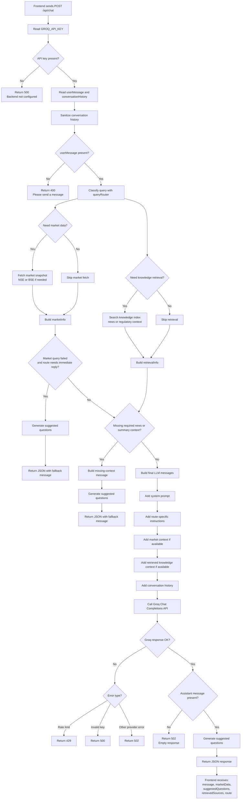

```mermaid
flowchart TD
    A[Frontend sends POST /api/chat] --> B[Read GROQ_API_KEY]
    B --> C{API key present?}

    C -- No --> C1[Return 500<br/>Backend not configured]
    C -- Yes --> D[Read userMessage and conversationHistory]
    D --> E[Sanitize conversation history]
    E --> F{userMessage present?}

    F -- No --> F1[Return 400<br/>Please send a message]
    F -- Yes --> G[Classify query with queryRouter]

    G --> H{Need market data?}
    H -- Yes --> I[Fetch market snapshot<br/>NSE or BSE if needed]
    H -- No --> J[Skip market fetch]

    G --> K{Need knowledge retrieval?}
    K -- Yes --> L[Search knowledge index<br/>news or regulatory context]
    K -- No --> M[Skip retrieval]

    I --> N[Build marketInfo]
    J --> N
    L --> O[Build retrievalInfo]
    M --> O

    N --> P{Market query failed<br/>and route needs immediate reply?}
    P -- Yes --> P1[Generate suggested questions]
    P1 --> P2[Return JSON with fallback message]
    P -- No --> Q{Missing required news or summary context?}

    O --> Q
    Q -- Yes --> Q1[Build missing-context message]
    Q1 --> Q2[Generate suggested questions]
    Q2 --> Q3[Return JSON with fallback message]
    Q -- No --> R[Build final LLM messages]

    R --> R1[Add system prompt]
    R1 --> R2[Add route-specific instructions]
    R2 --> R3[Add market context if available]
    R3 --> R4[Add retrieved knowledge context if available]
    R4 --> R5[Add conversation history]

    R5 --> S[Call Groq Chat Completions API]
    S --> T{Groq response OK?}

    T -- No --> T1{Error type?}
    T1 -- Rate limit --> T2[Return 429]
    T1 -- Invalid key --> T3[Return 500]
    T1 -- Other provider error --> T4[Return 502]

    T -- Yes --> U{Assistant message present?}
    U -- No --> U1[Return 502<br/>Empty response]
    U -- Yes --> V[Generate suggested questions]

    V --> W[Return JSON response]
    W --> X[Frontend receives:
message, marketData,
suggestedQuestions,
retrievedSources, route]

```