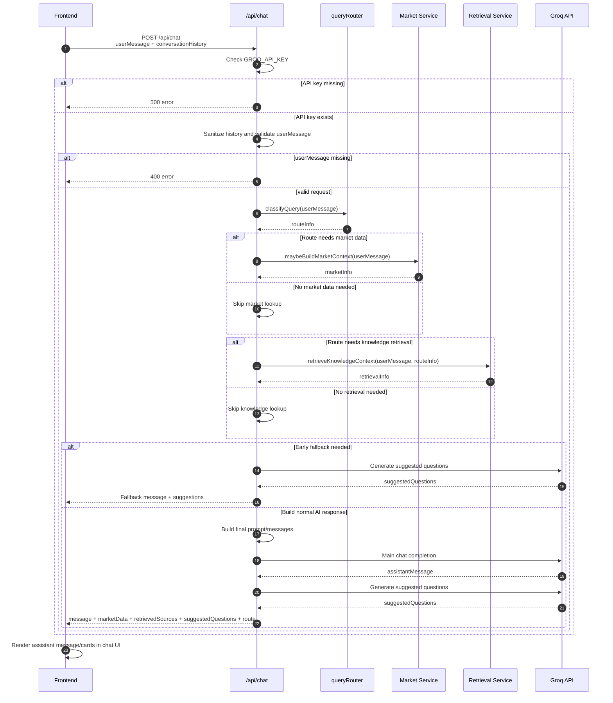

```mermaid
sequenceDiagram
    autonumber
    participant FE as Frontend
    participant API as /api/chat
    participant QR as queryRouter
    participant MK as Market Service
    participant RAG as Retrieval Service
    participant GROQ as Groq API

    FE->>API: POST /api/chat<br/>userMessage + conversationHistory
    API->>API: Check GROQ_API_KEY
    alt API key missing
        API-->>FE: 500 error
    else API key exists
        API->>API: Sanitize history and validate userMessage
        alt userMessage missing
            API-->>FE: 400 error
        else valid request
            API->>QR: classifyQuery(userMessage)
            QR-->>API: routeInfo

            alt Route needs market data
                API->>MK: maybeBuildMarketContext(userMessage)
                MK-->>API: marketInfo
            else No market data needed
                API->>API: Skip market lookup
            end

            alt Route needs knowledge retrieval
                API->>RAG: retrieveKnowledgeContext(userMessage, routeInfo)
                RAG-->>API: retrievalInfo
            else No retrieval needed
                API->>API: Skip knowledge lookup
            end

            alt Early fallback needed
                API->>GROQ: Generate suggested questions
                GROQ-->>API: suggestedQuestions
                API-->>FE: Fallback message + suggestions
            else Build normal AI response
                API->>API: Build final prompt/messages
                API->>GROQ: Main chat completion
                GROQ-->>API: assistantMessage
                API->>GROQ: Generate suggested questions
                GROQ-->>API: suggestedQuestions
                API-->>FE: message + marketData + retrievedSources + suggestedQuestions + route
            end
        end
    end

    FE->>FE: Render assistant message/cards in chat UI

```