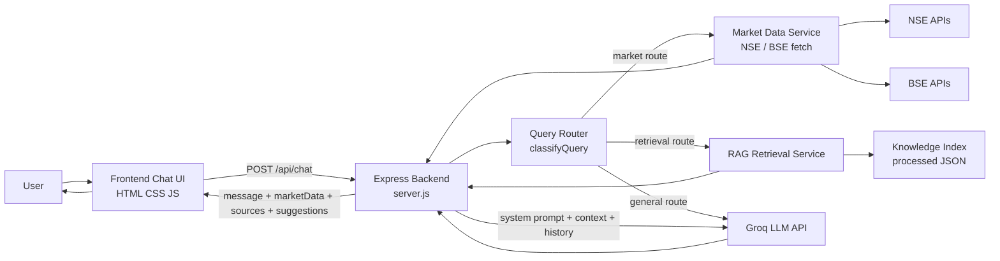

# System Architecture Overview for Project Report

## 1. Introduction
Financial Companion AI is a full-stack web application designed to help beginner investors understand financial concepts, market movements, and regulatory topics in simple language. The system combines a lightweight browser-based interface, a Node.js and Express backend, live market enrichment from NSE public endpoints, and retrieval-augmented answer grounding from a locally maintained knowledge base.

The architecture is designed to keep the client simple while centralizing orchestration, external API access, and AI prompt construction on the server side.

## 2. Architectural Style
The project follows a layered architecture with a single deployable backend service.

The major architectural layers are:
- Presentation layer
- Application and orchestration layer
- Enrichment and retrieval layer
- External integration layer
- Knowledge and content pipeline layer

This structure allows the frontend to remain thin while the backend handles routing, data enrichment, retrieval logic, and LLM communication.

## 3. High-Level Architecture Diagram

## 4. Major Components

### 4.1 Presentation Layer
The presentation layer is implemented using static frontend files.

Primary files:
- `frontend/index.html`
- `frontend/app.js`
- `frontend/styles.css`

Responsibilities:
- render the chat interface
- capture user interactions
- maintain local conversation state
- call the backend chat API
- render assistant replies and supplementary UI blocks
- provide the inline SIP calculator experience

The frontend does not directly call external LLM or market data providers. All such calls are routed through the backend.

### 4.2 Application Layer
The application layer is implemented in `backend/server.js` using Express.

Responsibilities:
- serve frontend assets
- expose API endpoints
- validate requests
- sanitize chat history
- orchestrate route selection
- invoke enrichment and retrieval modules
- call the LLM provider
- construct final response payloads

This layer acts as the central coordinator of the system.

### 4.3 Query Routing Layer
The routing layer is implemented in `backend/services/queryRouter.js`.

Its purpose is to classify user messages into execution paths. These paths decide whether the system should:
- answer directly using the LLM
- fetch live market data
- retrieve grounded context from the knowledge index
- combine market and retrieval context in hybrid flows

Supported routes include:
- `general_llm`
- `regulatory_rag`
- `news_rag`
- `live_market`
- `stock_analysis`
- `hybrid_market_news`
- `hybrid_market_summary`

### 4.4 Market Enrichment Layer
The market enrichment logic is implemented inside `backend/server.js` through the `maybeBuildMarketContext` flow.

Responsibilities:
- detect instrument intent from the user query
- resolve whether the query refers to an index or an equity
- fetch current market data from NSE public endpoints
- compute derived insights such as tone, range position, support, and resistance
- prepare structured `marketData` for frontend rendering
- prepare text context for LLM grounding

This layer is only invoked for routes that require market awareness.

### 4.5 Retrieval Layer
The retrieval layer is implemented in `backend/services/rag/retrievalService.js`.

Responsibilities:
- load the processed knowledge index
- tokenize and normalize the user query
- score stored chunks against the query
- filter by route-specific scope
- enforce freshness constraints for news content
- return both prompt context and displayable source metadata

The retrieval mechanism is file-based and uses scored JSON chunks instead of a runtime vector database.

### 4.6 LLM Integration Layer
The backend integrates with Groq chat completions for response generation.

Two model interactions may happen for a single user query:
- main answer generation
- suggested follow-up question generation

The main answer uses:
- system instructions
- optional route-specific instructions
- optional live market context
- optional retrieved knowledge context
- sanitized conversation history

This design keeps model access secure because the API key remains on the backend.

## 5. Data Architecture

### 5.1 Raw Knowledge Store
The raw knowledge layer includes:
- `data/knowledge/raw/sebi/`
- `data/knowledge/raw/news/ingested/`

These directories contain the original documents used to build the runtime retrieval index.

### 5.2 Processed Knowledge Store
The processed layer includes:
- `data/knowledge/processed/knowledge-index.json`
- `data/knowledge/processed/news-manifest.json`

`knowledge-index.json` is the primary runtime retrieval asset.

`news-manifest.json` stores metadata about the latest ingested news set.

### 5.3 Unused Chroma Store
A `data/chroma/` directory exists in the repository, but the active runtime path does not use it. The current implementation relies on the JSON knowledge index for retrieval.

## 6. Request Processing Flow
The runtime flow of a user message is as follows:

1. The user sends a message from the frontend.
2. The frontend stores local state, updates the UI, and sends the message to `/api/chat`.
3. The backend validates the request and sanitizes conversation history.
4. The query router selects the appropriate route.
5. If required, the backend fetches live market data.
6. If required, the backend retrieves supporting knowledge context.
7. The backend checks whether an early fallback response is more appropriate.
8. If not, the backend assembles the final prompt and calls the LLM.
9. The backend may call the LLM again to generate suggested follow-up questions.
10. The frontend renders the response, including optional market cards, source cards, and follow-up chips.

## 7. Background Content Pipeline

### 7.1 News Ingestion
Implemented in `backend/scripts/ingest-news.js`.

Responsibilities:
- read configured RSS or Atom feeds
- fetch articles
- normalize and deduplicate content
- write generated news documents into the raw knowledge directory
- update the news manifest

### 7.2 Knowledge Index Construction
Implemented in `backend/scripts/build-knowledge-index.js`.

Responsibilities:
- read raw SEBI and news documents
- infer metadata fields
- split content into chunks
- write the processed knowledge index used by runtime retrieval

### 7.3 Combined Refresh Pipeline
Implemented in `backend/scripts/refresh-news.js`.

Responsibilities:
- run news ingestion
- rebuild the knowledge index

This keeps the knowledge base current without changing runtime application logic.

## 8. External Dependencies and Integrations
The application depends on the following external systems:
- Groq API for answer and suggestion generation
- NSE public APIs for live market snapshots
- RSS or Atom feeds for market news ingestion

The backend isolates these dependencies from the frontend.

## 9. Deployment Model
The project uses a unified deployment model where:
- one Express server hosts both the frontend and backend API
- the browser communicates only with the backend
- the backend owns all external service communication
- environment variables store configuration and secrets

This model simplifies deployment and reduces client-side exposure of sensitive integrations.

## 10. Strengths of the Architecture
Key strengths include:
- simple full-stack deployment model
- clear route-driven orchestration
- separation between market enrichment and retrieval logic
- secure backend-only model integration
- controllable knowledge refresh pipeline
- lightweight client implementation

## 11. Current Limitations
Current limitations include:
- orchestration logic is concentrated in `backend/server.js`
- retrieval is based on local scoring rather than semantic vector search at runtime
- suggested questions add an additional LLM request per chat turn
- market data depends on public NSE endpoints and cookie bootstrap handling
- content refresh is script-based rather than scheduler-driven inside the app

## 12. Conclusion
The system architecture of Financial Companion AI is well-suited for a beginner-focused financial assistant that needs to combine conversational AI, live market awareness, and grounded knowledge retrieval in a single lightweight deployment. The design emphasizes practicality, secure integration, and controlled content grounding while keeping the frontend simple and the backend extensible.
